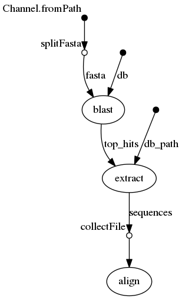
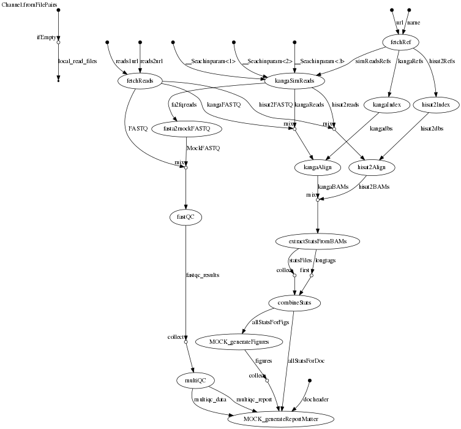

```{r setup, include=FALSE}
knitr::opts_chunk$set(cache=TRUE)
```


## Ingredients for reproducibility in data science

* data

```{bash, comment='', echo=FALSE}
#curl -s ftp://ftp.ensemblgenomes.org/pub/plants/release-38/fasta/arabidopsis_thaliana/dna/Arabidopsis_thaliana.TAIR10.dna.toplevel.fa.gz | gunzip --stdout | head
head data/At.head.fa
```

* code

```{bash, comment='', echo=FALSE}
head bin/extractStatsFromBAM.sh
```

* compute environment 

```{R, comment='', echo=FALSE}
sessionInfo()
```


----

<div class="column-left">

[{ width=80% }](https://xkcd.com/242/)

<small> [https://xkcd.com/242/](https://xkcd.com/242/) </small>
</div>

<div class="column-right">

### Let others (and yourself!) relaibly re-run your analyses 

  * new data
  * updated software
  * different compute environment (cloud?)
  * errors found
  * new ideas 

### Workflow management system might help...

</div>

----
### Aims & considerations

  * turn-key reproducibility
  * re-usability

<div class="column-right">
<!--{width=33%}-->
{width=33%}
</div>


  * active development
  * (community) support
  * learning curve

----

## Workflow systems

* [214 sytems and counting](https://s.apache.org/existing-workflow-systems)
* From `make` to Galaxy
* Among command-line based systems commonly used in bioinformatics and (so far) well supported
  * Snakemake *a pythonic workflow system*
    * follows `make` philosophy
    * rules and patterns that depend on input/output file names
    * explicit, precomputed DAG 
  * Nextflow 
    * dataflow programming model - think Unix pipes
    * implicit DAG, not known in advance
* Comparisons
  * [https://vatlab.github.io/blog/post/comparison/](https://vatlab.github.io/blog/post/comparison/)
  * [https://www.nature.com/articles/nbt.3820/tables/1](https://www.nature.com/articles/nbt.3820/tables/1)

----


## [Nextflow](https://www.nextflow.io/) 

### A Workflow management system which promises 

  * Portability, scalability and reproducibility

### Features 

* Separation of pipeline logic from compute environment definition(s)
* Syntax is a superset of Groovy, but **polyglot**
  * easily mix scripting languages

* Multiple _executors_
  * SGE, LSF, **SLURM**, PBS/Torque, NQSII HTCondor, Ignite, Kubernets, AWS Batch
* NEW! Support for Conda/[Bioconda](https://bioconda.github.io/)
    
<small>[https://www.nature.com/articles/nbt.3820/](https://www.nature.com/articles/nbt.3820)</small>


----

## More about Nextflow 

* Designed for specific use case: seamless scalability of existing tools and scripts
* Aimed at 

* Processes (tasks) in separate work directories
  * safe and lock-free parallelization
  * easy cleanup, no issue of partial results following an error
* Channels

*The dataflow model is superior to alternative solutions based on a Make-like approach, such as Snakemake, in which computation involves the pre-estimation of all computational dependencies, starting from the expected results up until the input raw data. A Make-like procedure requires a directed acyclic graph (DAG), whose storage requirement is a limiting factor for very large computations. In contrast, as the top to bottom processing model used by Nextflow follows the natural flow of data analysis, it does not require a DAG. Instead, the graph it traverses is merely incidental and does not need to be pre-computed or even stored, thereby ensuring high scalability.*


<!--<!--Collected and abbreviated from [here](https://groups.google.com/forum/#!topic/nextflow/Kg_0jv4SS_Q)-->-->

<!--Individual work directories are core to how NextFlow works and come with several benefits, reproducibility, makes debugging easier, facilitates simple integration into containers and allows separation of workflow steps to avoid unintended consequences. It must also be noted this mechanism enable to parallelise the tasks in a safe and lock-free manner and to resume the pipeline execution seamlessly, in a consistent manner ie. without retained partial outputs following an unexpected error.-->

<!--The NF work directory is not meant to hold the pipeline outputs, but the pipeline intermediate results, which can/should be removed once your workflow has been successfully executed. -->

<!--Pipeline outputs are meant to be managed (and structured) by using the publishDir definition. -->

<!--NF is not a general purpose software. It's a framework designed for a very specify use case ie. to enable seamless scalability and parallelisation of existing tools and scripts. It's based on functional/reactive model that's uncommon to other frameworks and it may require a bit of time to get used to it and to see its befits.-->

<!--Said that, the `storeDir` allows users to store data on a directory of their choice, but it comes with some caveats and it should not to be considered as alternative to the NF default directory structure mechanism. -->

<!--NF allows you to compose one or more commands by using template files as you are correctly referring. A template is simple text file which can contain NF variables which allows you to parametrise it and it can be used in different processes. However you will still need to declare the process definition in your script. -->

<!--Inclusion of a NF script into other NF script it's not supported at this time, but it's an open effort. However it's still possibile to invoke a NF pipeline from a NF process like any other command.-->

<!--The dataflow model is superior to alternative solutions based on a Make-like approach, such as Snakemake, in which computation involves the pre-estimation of all computational dependencies, starting from the expected results up until the input raw data. A Make-like procedure requires a directed acyclic graph (DAG), whose storage requirement is a limiting factor for very large computations. In contrast, as the top to bottom processing model used by Nextflow follows the natural flow of data analysis, it does not require a DAG. Instead, the graph it traverses is merely incidental and does not need to be pre-computed or even stored, thereby ensuring high scalability.-->

<!--The use of communication channels between tasks also contributes to computational flexibility and robustness in Nextflow. For example, in Snakemake, the task execution sequence is defined by rules and patterns that depend on input/output file names. These dependencies make it difficult to handle multiple dynamically generated output files, and often require the implementation of low-level output management procedures to deal with a pipeline's individual stages. Nextflow can use any data structure and outputs are not limited to files but can also include in-memory values and data objects.-->

<!--Nextflow is designed specifically for bioinformaticians familiar with programming. This sets it apart from Galaxy18, which addresses the numerical stability issue with a custom package manager called Tool Shed. Although the graphical user interface (GUI) in Galaxy offers powerful support for de novo pipeline implementation by non-specialists, it also imposes a heavy development burden because any existing and validated third-party pipeline must be re-implemented and re-parameterized using the GUI. This can be very demanding in the case of elaborate pipelines, such as the Sanger Companion pipeline, which is made with a complex combination of tools. Similar reimplementation requirements also apply to other tools, including Toil.-->

----

## Getting started

### Required

* Java 8

### Software you want to run 

* Available on PATH or under `bin/` 
* via Docker
* via Singularity (available on Pearcey)
* via Conda (`miniconda` available on Pearcey)
* via Modules (available* on Pearcey)

### Install

```
curl -s https://get.nextflow.io | bash
```

----

## Syntax (Hello world)

```{bash, comment=''} 
curl -sL  https://raw.githubusercontent.com/nextflow-io/hello/master/main.nf
```


----

## [Hello  ~~world~~ shared pipelines](https://www.nextflow.io/blog/2014/share-nextflow-pipelines-with-github.html) 

```{bash, comment=''}
nextflow run hello
```

```{bash, comment=''}
nextflow info hello
```

----

## Run specific revision (tag/branch/commit SHA)

```{bash, eval=FALSE}
nextflow run hello -r v1.1 
```

```{bash, eval=FALSE}
nextflow run hello -r mybranch 
```

```{bash, comment=''}
nextflow run hello -r 451ebd9
```

----

## Something a bit more useful

<div class="column-left">

</div>

<div class="column-right">

```{bash, comment=''}
nextflow run blast/blast.nf -with-dag doc/blast.png | head -20
```

</div>

----

## Compute profiles 

* Implemented/tested
  - `standard` (i.e. local/interactive assuming all software available)
  - `slurm`
  - `modules`
  - `docker`
  - `singularity`
  - `ec2` (inluding autoscaling)
  - `conda` (missing a bioconda recipe for biokanga)

```{bash, eval = FALSE}
# some of the profiles can, and others are intended to be used in concert, e.g. 
nextflow run csiro-crop-informatics/reproducible_poc -r develop -profile slurm,modules
# or 
nextflow run csiro-crop-informatics/reproducible_poc -r develop -profile slurm,singularity,singularitymodule
```

* Next: `k8s`, `awsbatch`, ...

----


## Modules

* Required modules are defined separately and explicitly for each process (or associated with labels)

```{bash, comment=''}
curl -sL https://raw.githubusercontent.com/csiro-crop-informatics/reproducible_poc/develop/conf/modules.config
```

* Note! These are compute environment specific

----

## Containers

* Required containers are defined separately and explicitly for each process (or associated with labels)
* Available on docker hub
  * Used both by `docker` and `singularity`
  * Always specify version tag (avoid `':latest'`)

```{bash, comment=''}
curl -sL https://raw.githubusercontent.com/csiro-crop-informatics/reproducible_poc/develop/conf/containers.config
```
----


## Real pipelines get a bit more complicated

```{bash, comment=''}
nextflow run csiro-crop-informatics/reproducible_poc -r develop -profile singularity -with-dag doc/flowchart.dot
```

----

```{bash, comment=''}
nextflow run csiro-crop-informatics/reproducible_poc -r develop -resume -profile singularity --nsimreads 10000 
```


----

## Pipeline flow

```{bash, echo = FALSE}
dot -Tpng -odoc/flowchart.png doc/flowchart.dot
dot -Tpng -Gsize=9,7\! -Gdpi=100 -odoc/flowchart_small.png doc/flowchart.dot
```

[](doc/flowchart.png)

----

## Pipeline syntax

* Primarily definitions of processes, each with well defined input and output channels

```{bash, comment=''}
curl -sL https://raw.githubusercontent.com/csiro-crop-informatics/reproducible_poc/develop/main.nf
```


----


## These slides

* Source: [nf-intro.Rmd](https://github.com/rsuchecki/nextflow_intro.Rmd)
* Tools and packages:
  * R, Pandoc, `rmarkdown`, `revealjs`, `kableExtra`
* Use R, RStudio or a simple `RScript` to render from the command line


```{bash, eval = FALSE}
./render.R nf-intro.Rmd "revealjs::revealjs_presentation"
```

```{bash, comment='', echo = FALSE}
cat render.R
```

* Output: [https://rsuchecki.github.io/nextflow_intro/nf-intro.html](https://rsuchecki.github.io/nextflow_intro/nf-intro.html)

----

## Workflow introspection 

* Nextflow offers detailed 
  * execution [reports](https://rsuchecki.github.io/reproducible/report.html) 
  * execution [timelines](https://rsuchecki.github.io/reproducible/timeline.html) 


<link rel="stylesheet" href="//cdnjs.cloudflare.com/ajax/libs/highlight.js/9.11.0/styles/default.min.css">
<script src="//cdnjs.cloudflare.com/ajax/libs/highlight.js/9.11.0/highlight.min.js"></script>

<script>
function highlightCode() {
    var pres = document.querySelectorAll("pre>code");
    for (var i = 0; i < pres.length; i++) {
        hljs.highlightBlock(pres[i]);
    }
}
highlightCode();
</script>


